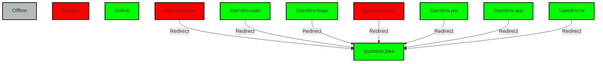

# SiteEvolution
The previously known website, Tamilrockers, has transitioned to 1TamilMV. Analyzing its functionality involves studying its behavior with daily scans.


**Powered by Invision Community**

https://invisioncommunity.com/


# my setting

sudo gedit /etc/resolv.conf

```
# Generated by NetworkManager
#nameserver 218.248.112.1
#nameserver 218.248.112.65
#nameserver 2001:4490:3ffe:13::4
#nameserver 2001:4490:3ffe:13::c
############
# modify the DNS entries
nameserver 8.8.8.8
nameserver 8.8.4.4
nameserver 2001:4490:3ffe:13::4
nameserver 2001:4490:3ffe:13::c

```

IP_LIST

```
current official domain

www.1tamilmv.re		104.21.80.1
www.1tamilmv.re		104.21.64.1
www.1tamilmv.re		104.21.48.1
www.1tamilmv.re		104.21.16.1
www.1tamilmv.re		104.21.96.1
www.1tamilmv.re		104.21.32.1
www.1tamilmv.re		104.21.112.1


redirect domains

www.1tamilmv.uno	104.21.85.41
www.1tamilmv.uno	172.67.202.69

www.1tamilmv.sale	104.21.21.9
www.1tamilmv.sale	172.67.195.167

www.1tamilmv.legal	104.21.33.236
www.1tamilmv.legal	172.67.151.173

www.1tamilmv.com	104.21.94.224
www.1tamilmv.com	172.67.140.219


```


```
https://www.afnic.fr/en/domain-names-and-support/everything-there-is-to-know-about-domain-names/find-a-domain-name-or-a-holder-using-whois/

https://sarek.fi/


```


**List of telecom companies in India**


1. AirtelIndia
2. BSNL
3. Jio
4. VodafoneIdea


<table>
  <tr>
    <th>Days</th>
    <th>DATE</th>
    <th>URL_NO</th>
    <th>Domain</th>
    <th>IPAddress</th>
    <th>IP_WHOIS</th>
    <th>DNS</th>
    <th>Status{Online, Down, Redirect}</th>
    <th>Summery</th>
    
  </tr>
  <tr>
  <td style="width: 50px; word-wrap: break-word;">1</td>
    <td style="width: 50px; word-wrap: break-word;">Dec 29</td>
  <td style="width: 150px; word-wrap: break-word;">U1</td>
  <td style="width: 150px; word-wrap: break-word;">www.1tamilmv.uno</td>
  <td style="width: 150px; word-wrap: break-word;">104.21.85.41, 172.67.202.69</td>
  <td style="width: 150px; word-wrap: break-word;">Cloudflare</td>
  <td style="width: 200px; word-wrap: break-word;">1</td>
  <td style="width: 200px; word-wrap: break-word;">Redirect</td>
  <td style="width: 200px; word-wrap: break-word;">U1-->U2</td>
</tr>
  <tr>
  <td style="width: 50px; word-wrap: break-word;">2</td>
   <td style="width: 50px; word-wrap: break-word;">Dec 30</td>
  <td style="width: 150px; word-wrap: break-word;">U2</td>
  <td style="width: 150px; word-wrap: break-word;">www.1tamilmv.sale</td>
  <td style="width: 150px; word-wrap: break-word;">172.67.195.167, 104.21.21.9</td>
  <td style="width: 150px; word-wrap: break-word;">Cloudflare</td>
  <td style="width: 200px; word-wrap: break-word;">1</td>
  <td style="width: 200px; word-wrap: break-word;">Online</td>
  <td style="width: 200px; word-wrap: break-word;">U2</td>
</tr>
  <tr>
  <td style="width: 50px; word-wrap: break-word;">3</td>
   <td style="width: 50px; word-wrap: break-word;">Dec 31</td>
  <td style="width: 150px; word-wrap: break-word;">U1,U2</td>
  <td style="width: 150px; word-wrap: break-word;">www.1tamilmv.{uno,sale}</td>
  <td style="width: 150px; word-wrap: break-word;">Same 4 IP's</td>
  <td style="width: 150px; word-wrap: break-word;">Cloudflare</td>
  <td style="width: 200px; word-wrap: break-word;">1</td>
  <td style="width: 200px; word-wrap: break-word;">Online</td>
  <td style="width: 200px; word-wrap: break-word;">U2 and U1 Online</td>
</tr>
  <tr>
  <td style="width: 50px; word-wrap: break-word;">-</td>
   <td style="width: 50px; word-wrap: break-word;">-</td>
  <td style="width: 150px; word-wrap: break-word;">-</td>
  <td style="width: 150px; word-wrap: break-word;">2025</td>
  <td style="width: 150px; word-wrap: break-word;">-</td>
  <td style="width: 150px; word-wrap: break-word;">-</td>
  <td style="width: 200px; word-wrap: break-word;">-</td>
  <td style="width: 200px; word-wrap: break-word;">-</td>
  <td style="width: 200px; word-wrap: break-word;">-</td>
</tr>

  <tr>
  <td style="width: 50px; word-wrap: break-word;">4</td>
   <td style="width: 50px; word-wrap: break-word;">Jan 1</td>
  <td style="width: 150px; word-wrap: break-word;">U3</td>
  <td style="width: 150px; word-wrap: break-word;">www.1tamilmv.legal</td>
  <td style="width: 150px; word-wrap: break-word;">104.21.33.236,172.67.151.173</td>
  <td style="width: 150px; word-wrap: break-word;">Cloudflare</td>
  <td style="width: 200px; word-wrap: break-word;">1</td>
  <td style="width: 200px; word-wrap: break-word;">-</td>
  <td style="width: 200px; word-wrap: break-word;">U1,U2 and U3 Online</td>
</tr>
  <tr>
  <td style="width: 50px; word-wrap: break-word;">5</td>
   <td style="width: 50px; word-wrap: break-word;">Jan 2</td>
  <td style="width: 150px; word-wrap: break-word;">U3</td>
  <td style="width: 150px; word-wrap: break-word;">www.1tamilmv.legal</td>
  <td style="width: 150px; word-wrap: break-word;">104.21.33.236,172.67.151.173</td>
  <td style="width: 150px; word-wrap: break-word;">Cloudflare</td>
  <td style="width: 200px; word-wrap: break-word;">1</td>
  <td style="width: 200px; word-wrap: break-word;">-</td>
  <td style="width: 200px; word-wrap: break-word;">U1,U2 and U3 Online</td>
</tr>
  <tr>
  <td style="width: 50px; word-wrap: break-word;">6</td>
   <td style="width: 50px; word-wrap: break-word;">Jan 3</td>
  <td style="width: 150px; word-wrap: break-word;">U3</td>
  <td style="width: 150px; word-wrap: break-word;">www.1tamilmv.legal</td>
  <td style="width: 150px; word-wrap: break-word;">104.21.33.236,172.67.151.173</td>
  <td style="width: 150px; word-wrap: break-word;">Cloudflare</td>
  <td style="width: 200px; word-wrap: break-word;">1</td>
  <td style="width: 200px; word-wrap: break-word;">-</td>
  <td style="width: 200px; word-wrap: break-word;">U1,U2 and U3 Online</td>
</tr>
<tr>
  <td style="width: 50px; word-wrap: break-word;">7</td>
  <td style="width: 50px; word-wrap: break-word;">Jan 4</td>
  <td style="width: 150px; word-wrap: break-word;">U3</td>
  <td style="width: 150px; word-wrap: break-word;">www.1tamilmv.legal</td>
  <td style="width: 150px; word-wrap: break-word;">104.21.33.236,172.67.151.173</td>
  <td style="width: 150px; word-wrap: break-word;">Cloudflare</td>
  <td style="width: 200px; word-wrap: break-word;">1</td>
  <td style="width: 200px; word-wrap: break-word;">-</td>
  <td style="width: 200px; word-wrap: break-word;">U1,U2 and U3 Online</td>
</tr>
<tr>
  <td style="width: 50px; word-wrap: break-word;">8</td>
  <td style="width: 50px; word-wrap: break-word;">Jan 8</td>
  <td style="width: 150px; word-wrap: break-word;">U4</td>
  <td style="width: 150px; word-wrap: break-word;">www.1tamilmv.re</td>
  <td style="width: 150px; word-wrap: break-word;">104.21.33.236,172.67.151.173</td>
  <td style="width: 150px; word-wrap: break-word;">Cloudflare</td>
  <td style="width: 200px; word-wrap: break-word;">1</td>
  <td style="width: 200px; word-wrap: break-word;">-</td>
  <td style="width: 200px; word-wrap: break-word;">U1,U2,U3 and U4 Online</td>
</tr>
<tr>
  <td style="width: 50px; word-wrap: break-word;">8</td>
  <td style="width: 50px; word-wrap: break-word;">Jan 8</td>
  <td style="width: 150px; word-wrap: break-word;">U5</td>
  <td style="width: 150px; word-wrap: break-word;">www.1tamilmv.com</td>
  <td style="width: 150px; word-wrap: break-word;">104.21.33.236,172.67.151.173</td>
  <td style="width: 150px; word-wrap: break-word;">Cloudflare</td>
  <td style="width: 200px; word-wrap: break-word;">1</td>
  <td style="width: 200px; word-wrap: break-word;">-</td>
  <td style="width: 200px; word-wrap: break-word;">U1,U2,U3,u4 and U5 Online</td>
</tr>
<tr>
  <td style="width: 50px; word-wrap: break-word;">9</td>
  <td style="width: 50px; word-wrap: break-word;">Jan 9</td>
  <td style="width: 150px; word-wrap: break-word;">U5</td>
  <td style="width: 150px; word-wrap: break-word;">www.1tamilmv.com</td>
  <td style="width: 150px; word-wrap: break-word;">104.21.33.236,172.67.151.173</td>
  <td style="width: 150px; word-wrap: break-word;">Cloudflare</td>
  <td style="width: 200px; word-wrap: break-word;">1</td>
  <td style="width: 200px; word-wrap: break-word;">-</td>
  <td style="width: 200px; word-wrap: break-word;">U1,U2,U3,u4 and U5 Online</td>
</tr>
<tr>
  <td style="width: 50px; word-wrap: break-word;">10</td>
  <td style="width: 50px; word-wrap: break-word;">Jan 10</td>
  <td style="width: 150px; word-wrap: break-word;">U5</td>
  <td style="width: 150px; word-wrap: break-word;">www.1tamilmv.com</td>
  <td style="width: 150px; word-wrap: break-word;">104.21.33.236,172.67.151.173</td>
  <td style="width: 150px; word-wrap: break-word;">Cloudflare</td>
  <td style="width: 200px; word-wrap: break-word;">1</td>
  <td style="width: 200px; word-wrap: break-word;">-</td>
  <td style="width: 200px; word-wrap: break-word;">U1,U2,U3,and U4 Online</td>
</tr>
<tr>
  <td style="width: 50px; word-wrap: break-word;">11</td>
  <td style="width: 50px; word-wrap: break-word;">Jan 11</td>
  <td style="width: 150px; word-wrap: break-word;">U5</td>
  <td style="width: 150px; word-wrap: break-word;">www.1tamilmv.com</td>
  <td style="width: 150px; word-wrap: break-word;">104.21.33.236,172.67.151.173</td>
  <td style="width: 150px; word-wrap: break-word;">Cloudflare</td>
  <td style="width: 200px; word-wrap: break-word;">1</td>
  <td style="width: 200px; word-wrap: break-word;">-</td>
  <td style="width: 200px; word-wrap: break-word;">U1,U2,U3,and U4 Online</td>
</tr>
<tr>
  <td style="width: 50px; word-wrap: break-word;">12</td>
  <td style="width: 50px; word-wrap: break-word;">Jan 12</td>
  <td style="width: 150px; word-wrap: break-word;">U5</td>
  <td style="width: 150px; word-wrap: break-word;">www.1tamilmv.com</td>
  <td style="width: 150px; word-wrap: break-word;">104.21.33.236,172.67.151.173</td>
  <td style="width: 150px; word-wrap: break-word;">Cloudflare</td>
  <td style="width: 200px; word-wrap: break-word;">1</td>
  <td style="width: 200px; word-wrap: break-word;">-</td>
  <td style="width: 200px; word-wrap: break-word;">U1,U2,U3,U5 and U4 Online</td>
</tr>
<tr>
  <td style="width: 50px; word-wrap: break-word;">12</td>
  <td style="width: 50px; word-wrap: break-word;">Feb 3</td>
  <td style="width: 150px; word-wrap: break-word;">U6</td>
  <td style="width: 150px; word-wrap: break-word;">www.1tamilmv.pm</td>
  <td style="width: 150px; word-wrap: break-word;">104.21.22.127,172.67.205.9</td>
  <td style="width: 150px; word-wrap: break-word;">Cloudflare</td>
  <td style="width: 200px; word-wrap: break-word;">1</td>
  <td style="width: 200px; word-wrap: break-word;">-</td>
  <td style="width: 200px; word-wrap: break-word;">U1,U2,U3,U5,U6 and U4 Online</td>
</tr>
<tr>
  <td style="width: 50px; word-wrap: break-word;">13</td>
  <td style="width: 50px; word-wrap: break-word;">Feb 7</td>
  <td style="width: 150px; word-wrap: break-word;">U7</td>
  <td style="width: 150px; word-wrap: break-word;">www.1tamilmv.app</td>
  <td style="width: 150px; word-wrap: break-word;">104.21.22.127,172.67.205.9</td>
  <td style="width: 150px; word-wrap: break-word;">Cloudflare</td>
  <td style="width: 200px; word-wrap: break-word;">1</td>
  <td style="width: 200px; word-wrap: break-word;">-</td>
  <td style="width: 200px; word-wrap: break-word;">who is ?? .app?</td>
</tr>
<tr>
  <td style="width: 50px; word-wrap: break-word;">14</td>
  <td style="width: 50px; word-wrap: break-word;">Feb 7</td>
  <td style="width: 150px; word-wrap: break-word;">U8</td>
  <td style="width: 150px; word-wrap: break-word;">www.1tamilmv.bike</td>
  <td style="width: 150px; word-wrap: break-word;">104.21.22.127,172.67.205.9</td>
  <td style="width: 150px; word-wrap: break-word;">Cloudflare</td>
  <td style="width: 200px; word-wrap: break-word;">1</td>
  <td style="width: 200px; word-wrap: break-word;">-</td>
  <td style="width: 200px; word-wrap: break-word;">U2,U3,U5,U6,U7,U8 and U4 Online</td>
</tr>
<tr>
  <td style="width: 50px; word-wrap: break-word;">15</td>
  <td style="width: 50px; word-wrap: break-word;">Feb 21</td>
  <td style="width: 150px; word-wrap: break-word;">U9</td>
  <td style="width: 150px; word-wrap: break-word;">www.1tamilmv.tel</td>
  <td style="width: 150px; word-wrap: break-word;">-</td>
  <td style="width: 150px; word-wrap: break-word;">Cloudflare</td>
  <td style="width: 200px; word-wrap: break-word;">1</td>
  <td style="width: 200px; word-wrap: break-word;">-</td>
  <td style="width: 200px; word-wrap: break-word;">- U9</td>
</tr>
<tr>
  <td style="width: 50px; word-wrap: break-word;">16</td>
  <td style="width: 50px; word-wrap: break-word;">Apr 01</td>
  <td style="width: 150px; word-wrap: break-word;">U10</td>
  <td style="width: 150px; word-wrap: break-word;">www.1tamilmv.ms</td>
  <td style="width: 150px; word-wrap: break-word;">-</td>
  <td style="width: 150px; word-wrap: break-word;">Cloudflare</td>
  <td style="width: 200px; word-wrap: break-word;">1</td>
  <td style="width: 200px; word-wrap: break-word;">-</td>
  <td style="width: 200px; word-wrap: break-word;">- U10</td>
</tr>
</tr>
<tr>
  <td style="width: 50px; word-wrap: break-word;">17</td>
  <td style="width: 50px; word-wrap: break-word;">Apr 09</td>
  <td style="width: 150px; word-wrap: break-word;">U10</td>
  <td style="width: 150px; word-wrap: break-word;">www.1tamilmv.moi</td>
  <td style="width: 150px; word-wrap: break-word;">-</td>
  <td style="width: 150px; word-wrap: break-word;">Cloudflare</td>
  <td style="width: 200px; word-wrap: break-word;">1</td>
  <td style="width: 200px; word-wrap: break-word;">-</td>
  <td style="width: 200px; word-wrap: break-word;">- U11</td>
</tr>


</table>


<table>
  <tr>
    <th>Days</th>
    <th>DATE</th>
    <th>Domain</th>
    <th>AirtelIndia</th>
    <th>BSNL</th>
    <th>Jio</th>
    <th>VodafoneIdea</th>
    <th>Status{Online, Down, Redirect, Restrict}</th>
    
  </tr>
  <tr>
  <td style="width: 50px; word-wrap: break-word;">1</td>
    <td style="width: 50px; word-wrap: break-word;">Dec 29</td>
  <td style="width: 150px; word-wrap: break-word;">www.1tamilmv.uno</td>
  <td style="width: 150px; word-wrap: break-word;">Online</td>
  <td style="width: 150px; word-wrap: break-word;">Restrict</td>
  <td style="width: 150px; word-wrap: break-word;">Restrict</td>
  <td style="width: 150px; word-wrap: break-word;">not_check</td>
    <td style="width: 150px; word-wrap: break-word;">BSNL has restricted access to that site. If you change the DNS, you should be able to access it.</td>
</tr>
  <tr>
  <td style="width: 50px; word-wrap: break-word;">2</td>
    <td style="width: 50px; word-wrap: break-word;">Dec 30</td>
  <td style="width: 150px; word-wrap: break-word;">www.1tamilmv.sale</td>
  <td style="width: 150px; word-wrap: break-word;">Online</td>
  <td style="width: 150px; word-wrap: break-word;">Restrict</td>
  <td style="width: 150px; word-wrap: break-word;">Online</td>
  <td style="width: 150px; word-wrap: break-word;">not_check</td>
    <td style="width: 150px; word-wrap: break-word;">""</td>
</tr>
  <tr>
  <td style="width: 50px; word-wrap: break-word;">3</td>
    <td style="width: 50px; word-wrap: break-word;">Dec 31</td>
  <td style="width: 150px; word-wrap: break-word;">www.1tamilmv.sale</td>
  <td style="width: 150px; word-wrap: break-word;">Online</td>
  <td style="width: 150px; word-wrap: break-word;">Restrict</td>
  <td style="width: 150px; word-wrap: break-word;">Online</td>
  <td style="width: 150px; word-wrap: break-word;">not_check</td>
    <td style="width: 150px; word-wrap: break-word;">""</td>
</tr>
  <tr>
  <td style="width: 50px; word-wrap: break-word;">-</td>
    <td style="width: 50px; word-wrap: break-word;">-</td>
  <td style="width: 150px; word-wrap: break-word;">-</td>
  <td style="width: 150px; word-wrap: break-word;"></td>
  <td style="width: 150px; word-wrap: break-word;">2025</td>
  <td style="width: 150px; word-wrap: break-word;">-</td>
  <td style="width: 150px; word-wrap: break-word;">-</td>
    <td style="width: 150px; word-wrap: break-word;">-</td>
</tr>
  <tr>
  <td style="width: 50px; word-wrap: break-word;">4</td>
    <td style="width: 50px; word-wrap: break-word;">JAN 1</td>
  <td style="width: 150px; word-wrap: break-word;">www.1tamilmv.legal</td>
  <td style="width: 150px; word-wrap: break-word;">Online</td>
  <td style="width: 150px; word-wrap: break-word;">Restrict</td>
  <td style="width: 150px; word-wrap: break-word;">Online</td>
  <td style="width: 150px; word-wrap: break-word;">not_check</td>
    <td style="width: 150px; word-wrap: break-word;">""</td>
</tr>
  <tr>
  <td style="width: 50px; word-wrap: break-word;">5</td>
    <td style="width: 50px; word-wrap: break-word;">JAN 2</td>
  <td style="width: 150px; word-wrap: break-word;">www.1tamilmv.legal</td>
  <td style="width: 150px; word-wrap: break-word;">Online</td>
  <td style="width: 150px; word-wrap: break-word;">Restrict</td>
  <td style="width: 150px; word-wrap: break-word;">Online</td>
  <td style="width: 150px; word-wrap: break-word;">not_check</td>
    <td style="width: 150px; word-wrap: break-word;">""</td>
</tr>
<tr>
  <td style="width: 50px; word-wrap: break-word;">5</td>
  <td style="width: 50px; word-wrap: break-word;">JAN 3</td>
  <td style="width: 150px; word-wrap: break-word;">www.1tamilmv.legal</td>
  <td style="width: 150px; word-wrap: break-word;">Online</td>
  <td style="width: 150px; word-wrap: break-word;">Restrict</td>
  <td style="width: 150px; word-wrap: break-word;">Online</td>
  <td style="width: 150px; word-wrap: break-word;">not_check</td>
  <td style="width: 150px; word-wrap: break-word;">""</td>
</tr>
<tr>
  <td style="width: 50px; word-wrap: break-word;">6</td>
  <td style="width: 50px; word-wrap: break-word;">JAN 4</td>
  <td style="width: 150px; word-wrap: break-word;">www.1tamilmv.legal</td>
  <td style="width: 150px; word-wrap: break-word;">Online</td>
  <td style="width: 150px; word-wrap: break-word;">Restrict</td>
  <td style="width: 150px; word-wrap: break-word;">Online</td>
  <td style="width: 150px; word-wrap: break-word;">not_check</td>
  <td style="width: 150px; word-wrap: break-word;">""</td>
</tr>
<tr>
  <td style="width: 50px; word-wrap: break-word;">7</td>
  <td style="width: 50px; word-wrap: break-word;">JAN 8</td>
  <td style="width: 150px; word-wrap: break-word;">www.1tamilmv.re</td>
  <td style="width: 150px; word-wrap: break-word;">Online</td>
  <td style="width: 150px; word-wrap: break-word;">Restrict</td>
  <td style="width: 150px; word-wrap: break-word;">Online</td>
  <td style="width: 150px; word-wrap: break-word;">not_check</td>
  <td style="width: 150px; word-wrap: break-word;">""</td>
</tr>
<tr>
  <td style="width: 50px; word-wrap: break-word;">7</td>
  <td style="width: 50px; word-wrap: break-word;">JAN 8</td>
  <td style="width: 150px; word-wrap: break-word;">www.1tamilmv.com</td>
  <td style="width: 150px; word-wrap: break-word;">Online</td>
  <td style="width: 150px; word-wrap: break-word;">Restrict</td>
  <td style="width: 150px; word-wrap: break-word;">Online</td>
  <td style="width: 150px; word-wrap: break-word;">not_check</td>
  <td style="width: 150px; word-wrap: break-word;">""</td>
</tr>
<tr>
  <td style="width: 50px; word-wrap: break-word;">8</td>
  <td style="width: 50px; word-wrap: break-word;">JAN 9</td>
  <td style="width: 150px; word-wrap: break-word;">www.1tamilmv.com</td>
  <td style="width: 150px; word-wrap: break-word;">Online</td>
  <td style="width: 150px; word-wrap: break-word;">Restrict</td>
  <td style="width: 150px; word-wrap: break-word;">Online</td>
  <td style="width: 150px; word-wrap: break-word;">not_check</td>
  <td style="width: 150px; word-wrap: break-word;">""</td>
</tr>
<tr>
  <td style="width: 50px; word-wrap: break-word;">-</td>
  <td style="width: 50px; word-wrap: break-word;">JAN 10</td>
  <td style="width: 150px; word-wrap: break-word;">www.1tamilmv.com</td>
  <td style="width: 150px; word-wrap: break-word;">Online</td>
  <td style="width: 150px; word-wrap: break-word;">Restrict</td>
  <td style="width: 150px; word-wrap: break-word;">Restrict</td>
  <td style="width: 150px; word-wrap: break-word;">not_check</td>
  <td style="width: 150px; word-wrap: break-word;">""</td>
</tr>
<tr>
  <td style="width: 50px; word-wrap: break-word;">-</td>
  <td style="width: 50px; word-wrap: break-word;">JAN 11</td>
  <td style="width: 150px; word-wrap: break-word;">www.1tamilmv.com</td>
  <td style="width: 150px; word-wrap: break-word;">Online</td>
  <td style="width: 150px; word-wrap: break-word;">Restrict</td>
  <td style="width: 150px; word-wrap: break-word;">Restrict</td>
  <td style="width: 150px; word-wrap: break-word;">not_check</td>
  <td style="width: 150px; word-wrap: break-word;">""</td>
</tr>
<tr>
  <td style="width: 50px; word-wrap: break-word;">-</td>
  <td style="width: 50px; word-wrap: break-word;">JAN 12</td>
  <td style="width: 150px; word-wrap: break-word;">www.1tamilmv.com</td>
  <td style="width: 150px; word-wrap: break-word;">Online</td>
  <td style="width: 150px; word-wrap: break-word;">Restrict</td>
  <td style="width: 150px; word-wrap: break-word;">Restrict</td>
  <td style="width: 150px; word-wrap: break-word;">not_check</td>
  <td style="width: 150px; word-wrap: break-word;">""</td>
</tr>
</table>


## SiteFlow <a name = "flow"></a>



## MainDomain_Is


```

FEB_7_2025
www.1tamilmv.bike

```


```
Jan 10 2025

http://www.1tamilmv.com

**The Website has been blocked as per direction/order of Hon'ble Court**

But change the DNS address; all the other domains are easy to access.

```


**Used list of public trackers in 1TamilMV**


```


udp://tracker.opentrackr.org:1337/announce
udp://tracker.torrent.eu.org:451/announce
udp://tracker.dler.org:6969/announce
udp://open.stealth.si:80/announce
udp://opentracker.i2p.rocks:6969/announce
udp://tracker-udp.gbitt.info:80/announce
udp://tracker.tiny-vps.com:6969/announce
udp://movies.zsw.ca:6969/announce
https://opentracker.i2p.rocks:443/announce


Added
https://github.com/ngosang/trackerslist/issues/216


```


.Torrent file Decoder


```
sudo apt install python3-libtorrent

python3 Decoder_T2txt.py <2024.torrent>

```


**Whois That Metadata Info:**

### The uploader used software list 

```
hollywood[H] --> American film
kollywood[K] --> Tamil-language 
tollywood[T] --> Telugu
mollywood[M] --> Malayalam
bollywood[B] --> Hindi

```


<table>
<tr>
    <th>No</th>
    <th>Nick_Name</th>
    <th>DATE</th>
    <th>Software_V</th>
    <th>Update</th>
    <th>topic</th>
    <th>type</th>
    <th>Film</th>
    <th>Connection</th>
    <th>{[H],[K],[T],[M],[B]}</th>
</tr>
<tr>
  <td style="width: 50px; word-wrap: break-word;">1</td>
  <td style="width: 50px; word-wrap: break-word;">Screen(Elite)</td>
  <td style="width: 50px; word-wrap: break-word;">Jan 03</td>
  <td style="width: 150px; word-wrap: break-word;">BitTorrent/7.11</td>
  <td style="width: 150px; word-wrap: break-word;">BitTorrent 7.11.0 For Windows (build 46555)</td>
  <td style="width: 150px; word-wrap: break-word;">185172-0,185192</td>
  <td style="width: 150px; word-wrap: break-word;">185172</td>
  <td style="width: 150px; word-wrap: break-word;">Wallace & Gromit: Vengeance Most Fowl (2025)</td>
  <td style="width: 150px; word-wrap: break-word;">H</td>
  <td style="width: 150px; word-wrap: break-word;">H</td>
</tr>
<tr>
  <td style="width: 50px; word-wrap: break-word;">2</td>
  <td style="width: 50px; word-wrap: break-word;">S.P.I.D.E.R(Moderators)</td>
  <td style="width: 50px; word-wrap: break-word;">Jan 04</td>
  <td style="width: 150px; word-wrap: break-word;">qBittorrent v5.0.2 on 03 Jan 2025, BitTorrent/7.11 on 03 Jan 2025</td>
  <td style="width: 150px; word-wrap: break-word;">https://www.fosshub.com/qBittorrent-old.html</td>
  <td style="width: 150px; word-wrap: break-word;">184915-0</td>
  <td style="width: 150px; word-wrap: break-word;">185172</td>
  <td style="width: 150px; word-wrap: break-word;">The Flash (2014)</td>
  <td style="width: 150px; word-wrap: break-word;">Screen,S.P.I.D.E.R{184085} </td>
  <td style="width: 150px; word-wrap: break-word;">H</td>
</tr>
<tr>
  <td style="width: 50px; word-wrap: break-word;">3</td>
  <td style="width: 50px; word-wrap: break-word;"> 𝓣𝓜𝓥 𝓛𝓸𝓿𝓮𝓻 (Elite)</td>
  <td style="width: 50px; word-wrap: break-word;">Jan 04</td>
  <td style="width: 150px; word-wrap: break-word;">qBittorrent v5.0.1 on 03 Jan 2025</td>
  <td style="width: 150px; word-wrap: break-word;">https://www.fosshub.com/qBittorrent-old.html</td>
  <td style="width: 150px; word-wrap: break-word;">185193-0,185191</td>
  <td style="width: 150px; word-wrap: break-word;">185172</td>
  <td style="width: 150px; word-wrap: break-word;">Sonic the Hedgehog 3 (2024)</td>
  <td style="width: 150px; word-wrap: break-word;">-</td>
  <td style="width: 150px; word-wrap: break-word;">H</td>
</tr>
<tr>
  <td style="width: 50px; word-wrap: break-word;">4</td>
  <td style="width: 50px; word-wrap: break-word;"> Olan (Moderators)</td>
  <td style="width: 50px; word-wrap: break-word;">Jan 04</td>
  <td style="width: 150px; word-wrap: break-word;">qBittorrent v5.0.3 on 03 Jan 2025</td>
  <td style="width: 150px; word-wrap: break-word;">https://www.fosshub.com/qBittorrent-old.html</td>
  <td style="width: 150px; word-wrap: break-word;">185196-0</td>
  <td style="width: 150px; word-wrap: break-word;">WEB-DL</td>
  <td style="width: 150px; word-wrap: break-word;">Saakaaram (2024) </td>
  <td style="width: 150px; word-wrap: break-word;">-</td>
  <td style="width: 150px; word-wrap: break-word;">T</td>
</tr>
<tr>
  <td style="width: 50px; word-wrap: break-word;">5</td>
  <td style="width: 50px; word-wrap: break-word;">  SRK Don  (Moderators)</td>
  <td style="width: 50px; word-wrap: break-word;">Jan 04</td>
  <td style="width: 150px; word-wrap: break-word;">-</td>
  <td style="width: 150px; word-wrap: break-word;">-</td>
  <td style="width: 150px; word-wrap: break-word;">185197-0</td>
  <td style="width: 150px; word-wrap: break-word;">WEB-DL</td>
  <td style="width: 150px; word-wrap: break-word;">The Rana Daggubati Show (2025) S01 EP07 </td>
  <td style="width: 150px; word-wrap: break-word;">-</td>
  <td style="width: 150px; word-wrap: break-word;">T</td>
</tr>
<tr>
  <td style="width: 50px; word-wrap: break-word;">6</td>
  <td style="width: 50px; word-wrap: break-word;">TMV RULER(Moderators)</td>
  <td style="width: 50px; word-wrap: break-word;">Jan 04</td>
  <td style="width: 150px; word-wrap: break-word;">qBittorrent v5.0.3 on 03 Jan 2025</td>
  <td style="width: 150px; word-wrap: break-word;">-</td>
  <td style="width: 150px; word-wrap: break-word;">185200-0</td>
  <td style="width: 150px; word-wrap: break-word;">BluRay</td>
  <td style="width: 150px; word-wrap: break-word;">A Legend (2025)</td>
  <td style="width: 150px; word-wrap: break-word;">-</td>
  <td style="width: 150px; word-wrap: break-word;">H</td>
</tr>
<tr>
  <td style="width: 50px; word-wrap: break-word;">7</td>
  <td style="width: 50px; word-wrap: break-word;"> J.A.R.V.I.S. (TMV Releaser)</td>
  <td style="width: 50px; word-wrap: break-word;">Jan 04</td>
  <td style="width: 150px; word-wrap: break-word;"> BitTorrent/7.11 on 04 Jan 2025</td>
  <td style="width: 150px; word-wrap: break-word;">-</td>
  <td style="width: 150px; word-wrap: break-word;">185201-0</td>
  <td style="width: 150px; word-wrap: break-word;">HQ PreDVD</td>
  <td style="width: 150px; word-wrap: break-word;">Xtreme (2025) </td>
  <td style="width: 150px; word-wrap: break-word;">-</td>
  <td style="width: 150px; word-wrap: break-word;">K</td>
</tr>
</table>


```
TMV RULER(Moderators) --> Created by qBittorrent v5.0.4 on 21 Feb 2025
fbc56852ccf9b37252f1408d99568e676dff1d88

 65.109.72.223
```


IP_match

```
135.181.239.48 qBittorrent v5.0.3

that ip winodws server port open

http://135.181.239.48/

https://learn.microsoft.com/en-in/answers/questions/640298/how-do-i-disable-this-feature


sudo nmap -A -T4 135.181.239.48
```


```
qBittorrent 5.0.3

** 135.181.239.48
* 85.17.64.29
183.83.196.84
217.164.13.76


```


```
qBittorrent v5.0.1

* 65.109.117.110

23.88.70.253


```


```
1. Google DNS

    Primary DNS: 8.8.8.8
    Secondary DNS: 8.8.4.4
    Google DNS is fast and widely used across the globe.

2. Cloudflare DNS

    Primary DNS: 1.1.1.1
    Secondary DNS: 1.0.0.1
    Cloudflare DNS focuses on privacy and speed.

3. OpenDNS (by Cisco)

    Primary DNS: 208.67.222.222
    Secondary DNS: 208.67.220.220
    OpenDNS offers both free and premium DNS services with added security features.

4. Quad9 DNS

    Primary DNS: 9.9.9.9
    Secondary DNS: 149.112.112.112
    Quad9 blocks access to malicious websites and offers good privacy protection.

5. Comodo Secure DNS

    Primary DNS: 8.26.56.26
    Secondary DNS: 8.20.247.20
    Comodo provides a secure DNS service, focusing on blocking malware and phishing.

6. DNS.Watch

    Primary DNS: 84.200.69.80
    Secondary DNS: 84.200.70.40
    DNS.Watch is an independent and privacy-respecting DNS service.

7. AdGuard DNS

    Primary DNS: 94.140.14.14
    Secondary DNS: 94.140.15.15
    AdGuard DNS blocks ads and trackers.

8. Verisign DNS

    Primary DNS: 64.6.64.6
    Secondary DNS: 64.6.65.6
    Verisign is known for its reliability and privacy-focused DNS service.

9. SafeDNS

    Primary DNS: 195.46.39.39
    Secondary DNS: 195.46.39.40
    SafeDNS provides a secure DNS service with customizable filtering.

10. Yandex DNS

    Primary DNS: 77.88.8.8
    Secondary DNS: 77.88.8.1
    Yandex DNS offers good performance with malware protection.
```


Adjust the Site_suffix array as needed for the number of sites you want to check on that day.

Site_suffix=("uno" "sale")  # Add more suffixes if needed


```
bash daily_check.sh
```


**Day_1&2**

```

sab@debian:~$ nslookup www.1tamilmv.uno
Server:		8.8.8.8
Address:	8.8.8.8#53

Non-authoritative answer:
Name:	www.1tamilmv.uno
Address: 104.21.85.41
Name:	www.1tamilmv.uno
Address: 172.67.202.69
Name:	www.1tamilmv.uno
Address: 2606:4700:3032::6815:5529
Name:	www.1tamilmv.uno
Address: 2606:4700:3034::ac43:ca45


sab@debian:~$ nslookup www.1tamilmv.sale
Server:		8.8.8.8
Address:	8.8.8.8#53

Non-authoritative answer:
Name:	www.1tamilmv.sale
Address: 104.21.21.9
Name:	www.1tamilmv.sale
Address: 172.67.195.167
Name:	www.1tamilmv.sale
Address: 2606:4700:3031::ac43:c3a7
Name:	www.1tamilmv.sale
Address: 2606:4700:3034::6815:1509


```


**ping**


```


sab@debian:~$ ping www.1tamilmv.uno
PING www.1tamilmv.uno (104.21.85.41) 56(84) bytes of data.
64 bytes from 104.21.85.41 (104.21.85.41): icmp_seq=1 ttl=57 time=29.0 ms
64 bytes from 104.21.85.41 (104.21.85.41): icmp_seq=2 ttl=57 time=29.2 ms
64 bytes from 104.21.85.41 (104.21.85.41): icmp_seq=3 ttl=57 time=30.0 ms


sab@debian:~$ ping www.1tamilmv.sale
PING www.1tamilmv.sale (104.21.21.9) 56(84) bytes of data.
64 bytes from 104.21.21.9 (104.21.21.9): icmp_seq=1 ttl=57 time=28.5 ms

```


**BSNL DNS DETAILS**
https://99-networks.com/bsnl-dns-server-high-speed-internet/


